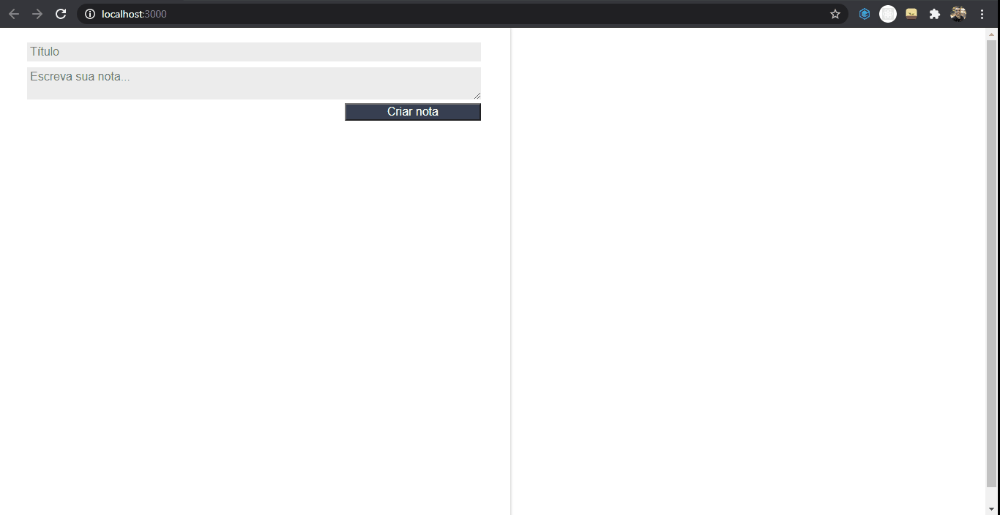

<h1 align="center"> 📝 My notepad 📝 </h1>

<div align="center">
  Application to write reminders.
</div>

<div align="center">


</div>

</div>

<p align="center">
 <a href="#about">About</a> |
 <a href="#techs">Tecnologies</a> |
 <a href="#requirements">Requirements</a> |
 <a href="#run">How to run</a> |
 <a href="#license">License</a> |
 <a href="#autor">Autor</a>
</p>

<br/>

## Preview

<div>
    
</div>

<br/>

## 📎 Features

- [x] Write new reminders
- [x] List reminder cards

<br>

<div id="about">

## About

This is a simple application built in React to reinforce the basic concepts of this framework.

</div>

<div id="techs">

## 🛠 Technologies
The following technologie is used:
- [React JS](https://pt-br.reactjs.org/)

</div>

<br>

<div id="run">

## ℹ How to run

### Requirements
Before to start, you will need to install the following tools:

- [React JS](https://pt-br.reactjs.org/)
- [Node.js](https://nodejs.org/en/)
- [Git](https://git-scm.com)

Clone the repository and install the dependencies:

```bash
# Cloning repository
$ git clone https://github.com/cesarramos95/my-notepad

# Acess the folder
$ cd my-notepad

# Installing dependencies
$ npm install

# Running server
$ npm start
```

<div id="license">

---

## 📝 License
This repository is under [MIT](./LICENSE) license.
</div>

<div id="autor">

## Autor


<br>
<a href="t.me/cesarramos95">César</a>

[](https://www.linkedin.com/in/cesararamos/)
[](mailto:cesarramos.aug@gmail.com)

</div>

---

Made with ❤ by César 👋 [Get in touch!](https://linkedin.com/in/cesararamos)

